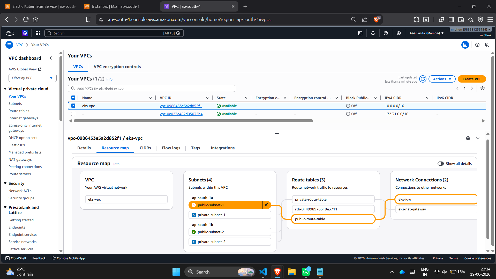
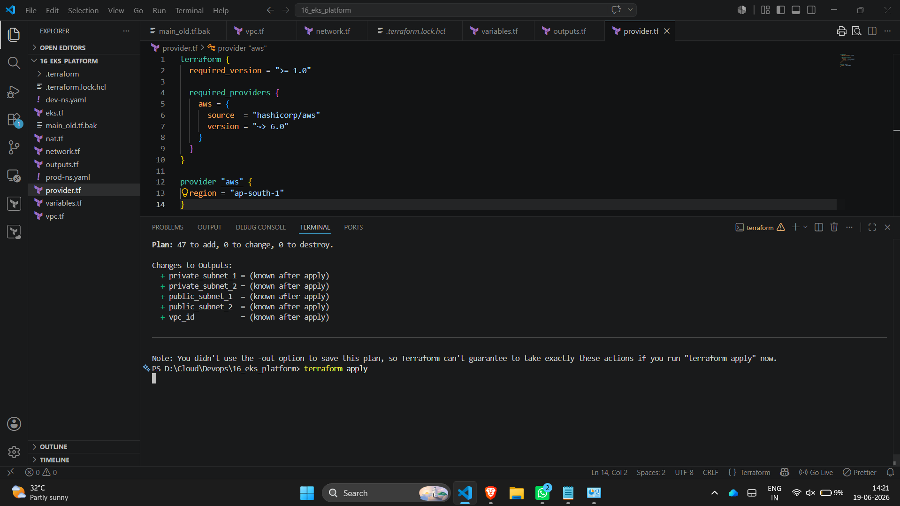
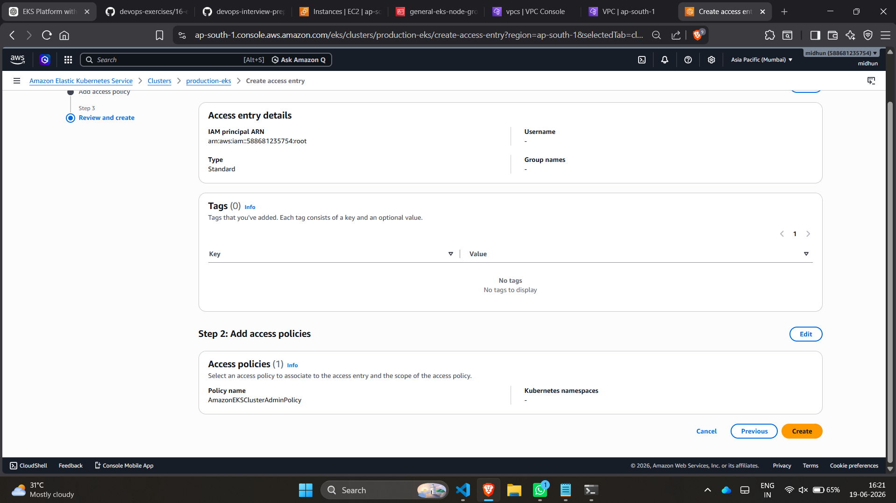
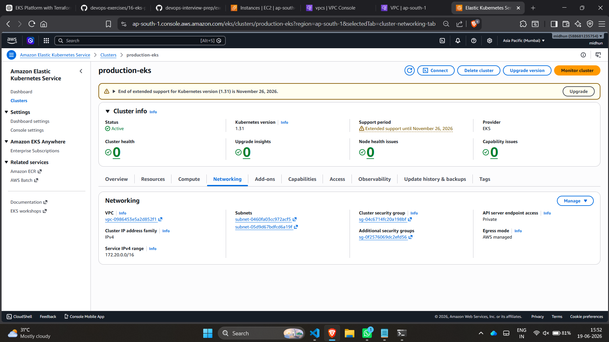
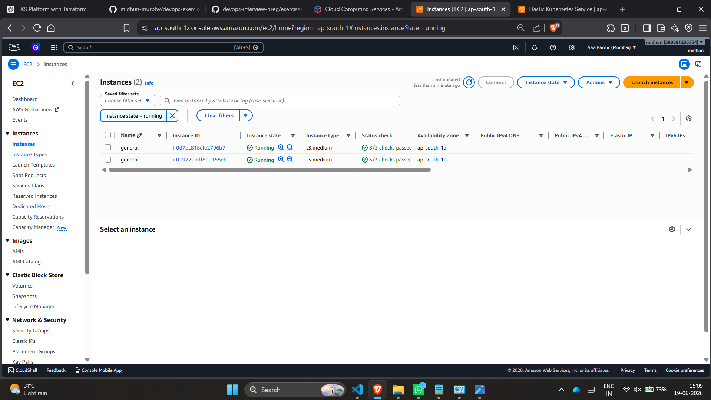
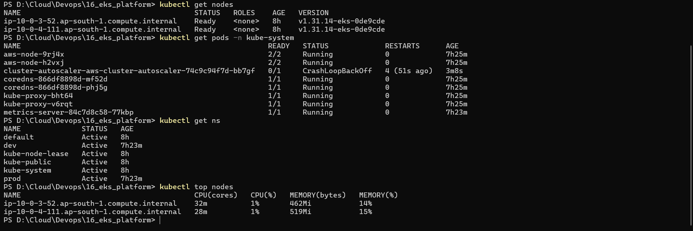

# Exercise 16 - Production EKS Platform with Terraform

## Overview

This project demonstrates the deployment of a production-ready Amazon EKS (Elastic Kubernetes Service) platform using Terraform. The infrastructure includes a custom VPC, public and private subnets across multiple Availability Zones, NAT Gateway, managed EKS node groups, Kubernetes namespaces, Metrics Server, and Cluster Autoscaler.

The platform follows AWS best practices by running worker nodes in private subnets while exposing the Kubernetes API endpoint publicly for management access.

---

## Architecture

### Infrastructure Components

- Amazon EKS Cluster (v1.31)
- Managed Node Group (t3.medium)
- Custom VPC
- Internet Gateway
- NAT Gateway
- Public Subnets (2)
- Private Subnets (2)
- Route Tables
- Security Groups
- Kubernetes Namespaces
- Metrics Server
- Cluster Autoscaler

---

## Project Structure

```text
16-eks-production-platform/
│
├── terraform/
│   ├── provider.tf
│   ├── vpc.tf
│   ├── network.tf
│   ├── nat.tf
│   ├── eks.tf
│   ├── variables.tf
│   ├── outputs.tf
│   └── .terraform.lock.hcl
│
├── kubernetes/
│   ├── dev-ns.yaml
│   ├── prod-ns.yaml
│   └── cluster-autoscaler-values.yaml
│
├── screenshots/
│   ├── vpc.png
│   ├── terraform-apply.png
│   ├── iam-eks.png
│   ├── eks-cluster-active.png
│   ├── ec2-running.png
│   └── output.png
│
└── README.md
```

---

## Prerequisites

- AWS Account
- AWS CLI configured
- Terraform >= 1.5
- kubectl
- Helm
- Git

---

## Deployment Steps

### 1. Initialize Terraform

```bash
terraform init
```

### 2. Validate Configuration

```bash
terraform validate
```

### 3. Review Infrastructure Plan

```bash
terraform plan
```

### 4. Deploy Infrastructure

```bash
terraform apply
```

---

## Configure kubectl

Update kubeconfig:

```bash
aws eks update-kubeconfig \
--region ap-south-1 \
--name production-eks
```

Verify cluster access:

```bash
kubectl get nodes
```

Expected Output:

```bash
NAME                                        STATUS   ROLES    AGE
ip-10-0-3-52.ap-south-1.compute.internal    Ready    <none>   xxm
ip-10-0-4-111.ap-south-1.compute.internal   Ready    <none>   xxm
```

---

## Create Kubernetes Namespaces

### Development Namespace

```bash
kubectl apply -f kubernetes/dev-ns.yaml
```

### Production Namespace

```bash
kubectl apply -f kubernetes/prod-ns.yaml
```

Verify:

```bash
kubectl get ns
```

---

## Install Metrics Server

```bash
kubectl apply -f https://github.com/kubernetes-sigs/metrics-server/releases/latest/download/components.yaml
```

Verify:

```bash
kubectl top nodes
```

Sample Output:

```bash
NAME                                        CPU(cores)   MEMORY(bytes)
ip-10-0-3-52.ap-south-1.compute.internal    41m          468Mi
ip-10-0-4-111.ap-south-1.compute.internal   29m          408Mi
```

---

## Install Cluster Autoscaler

Add Helm Repository:

```bash
helm repo add autoscaler https://kubernetes.github.io/autoscaler
helm repo update
```

Install Autoscaler:

```bash
helm install cluster-autoscaler \
autoscaler/cluster-autoscaler \
-n kube-system \
-f kubernetes/cluster-autoscaler-values.yaml
```

Verify:

```bash
kubectl get pods -n kube-system
```

---

## Validation Commands

### Verify Cluster

```bash
kubectl get nodes
```

### Verify Namespaces

```bash
kubectl get ns
```

### Verify Metrics

```bash
kubectl top nodes
```

### Verify Autoscaler

```bash
kubectl get deployment -n kube-system
```

### Verify Add-ons

```bash
aws eks list-addons \
--cluster-name production-eks \
--region ap-south-1
```

---

## Screenshots

### VPC Configuration



### Terraform Apply



### IAM Access Configuration



### EKS Cluster Active



### EC2 Worker Nodes



### Validation Output



---

## Key Learning Outcomes

- Provisioned EKS using Terraform
- Designed a custom VPC architecture
- Configured public and private subnets
- Deployed managed node groups
- Configured Kubernetes namespaces
- Installed Metrics Server
- Implemented Cluster Autoscaler
- Managed cluster access using IAM Access Entries
- Validated cluster health and node metrics
- Destroyed infrastructure safely after testing

---

## Cleanup

Destroy all AWS resources:

```bash
terraform destroy
```

Verify:

```bash
aws eks list-clusters --region ap-south-1
```

Expected Output:

```json
{
  "clusters": []
}
```

---

## Author

**Midhun Kumar V**
