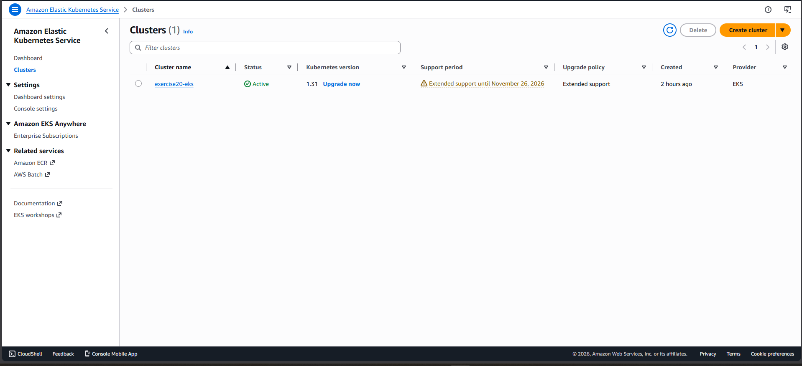
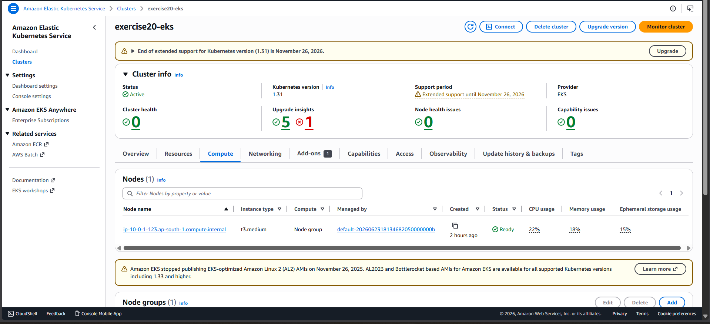
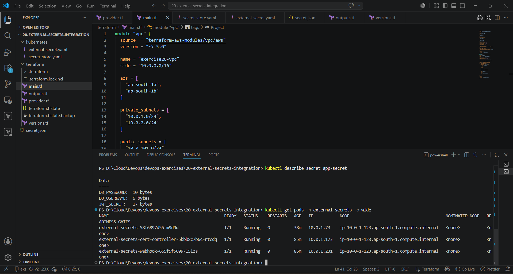
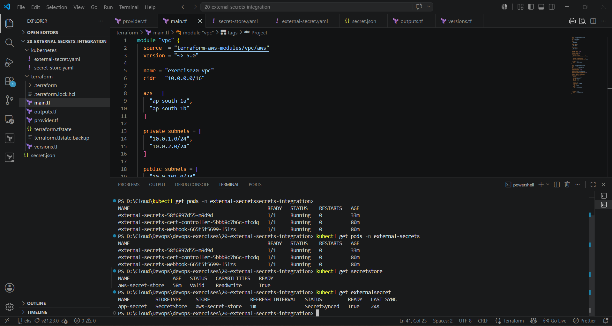
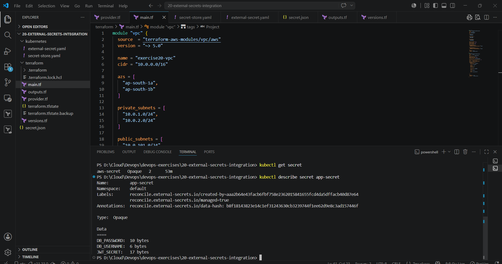

# 20 - External Secrets Integration with Amazon EKS

## Project Overview

This project demonstrates how to securely manage application secrets in Kubernetes using External Secrets Operator (ESO) and AWS Secrets Manager on an Amazon EKS cluster.

Instead of storing sensitive information directly inside Kubernetes manifests, secrets are stored in AWS Secrets Manager and automatically synchronized into Kubernetes Secrets using External Secrets Operator.

---

## Architecture

```text
AWS Secrets Manager
        │
        ▼
SecretStore
        │
        ▼
External Secrets Operator
        │
        ▼
Kubernetes Secret
        │
        ▼
Application
```

---

## Technologies Used

- Amazon EKS
- Terraform
- AWS Secrets Manager
- External Secrets Operator
- Kubernetes
- Helm
- AWS CLI

---

## Project Structure

```text
20-external-secrets-integration/
│
├── kubernetes/
│   ├── secret-store.yaml
│   └── external-secret.yaml
│
├── terraform/
│   ├── main.tf
│   ├── provider.tf
│   ├── outputs.tf
│   └── versions.tf
│
├── screenshots/
│   ├── eks-cluster.png
│   ├── nodes.png
│   ├── secretstore.png
│   ├── external-secret.png
│   ├── external-secret-pod.png
│   └── secret-created.png
│
├── .gitignore
└── README.md
```

---

## Prerequisites

- AWS Account
- Terraform
- kubectl
- Helm
- AWS CLI

---

## Step 1: Deploy EKS Cluster

```bash
terraform init
terraform validate
terraform apply -auto-approve
```

---

## Step 2: Configure kubectl

```bash
aws eks update-kubeconfig \
--region ap-south-1 \
--name exercise20-eks

kubectl get nodes
```

---

## Step 3: Install External Secrets Operator

```bash
helm repo add external-secrets https://charts.external-secrets.io

helm repo update

helm install external-secrets external-secrets/external-secrets \
-n external-secrets \
--create-namespace
```

Verify:

```bash
kubectl get pods -n external-secrets
```

---

## Step 4: Create Secret in AWS Secrets Manager

Store application secrets securely in AWS Secrets Manager.

Example:

```json
{
  "DB_USERNAME": "******",
  "DB_PASSWORD": "******",
  "JWT_SECRET": "******"
}
```

---

## Step 5: Create SecretStore

```bash
kubectl apply -f kubernetes/secret-store.yaml
```

Verify:

```bash
kubectl get secretstore
```

---

## Step 6: Create External Secret

```bash
kubectl apply -f kubernetes/external-secret.yaml
```

Verify:

```bash
kubectl get externalsecret
```

---

## Step 7: Verify Secret Synchronization

```bash
kubectl get secret
```

```bash
kubectl describe secret app-secret
```

Expected:

```text
DB_USERNAME: 6 bytes
DB_PASSWORD: 10 bytes
JWT_SECRET: 17 bytes
```

---

## Validation

### Verify Nodes

```bash
kubectl get nodes
```

### Verify External Secrets Pods

```bash
kubectl get pods -n external-secrets
```

### Verify SecretStore

```bash
kubectl get secretstore
```

### Verify External Secret

```bash
kubectl get externalsecret
```

### Verify Kubernetes Secret

```bash
kubectl get secret
```

---

## Screenshots

### EKS Cluster



### Worker Node Ready



### SecretStore Status


### External Secret



### External Secrets Pods



### Kubernetes Secret Created



---

## Key Learnings

- Provisioned EKS using Terraform
- Installed External Secrets Operator with Helm
- Managed secrets using AWS Secrets Manager
- Created SecretStore and ExternalSecret resources
- Synced AWS secrets into Kubernetes automatically
- Improved security by avoiding hardcoded credentials

---

## Cleanup

```bash
kubectl delete -f kubernetes/external-secret.yaml

kubectl delete -f kubernetes/secret-store.yaml

helm uninstall external-secrets -n external-secrets

cd terraform

terraform destroy -auto-approve
```

---

## Author

**Midhun Kumar V**

AWS | Terraform | Kubernetes | DevOps
